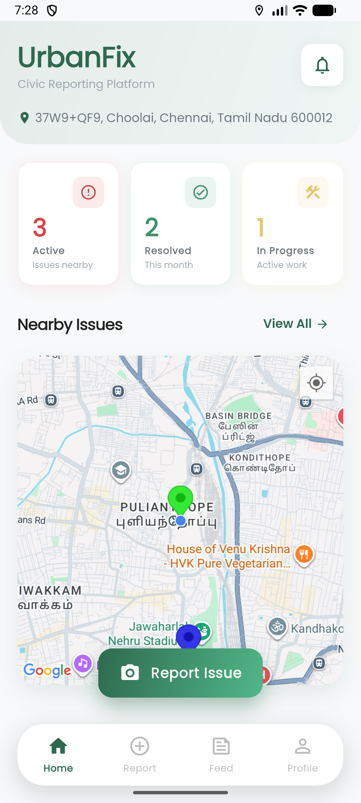
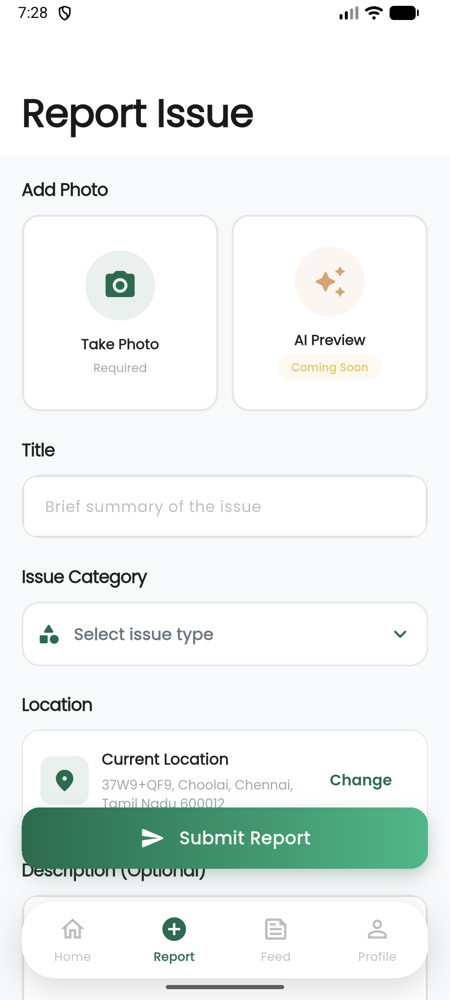
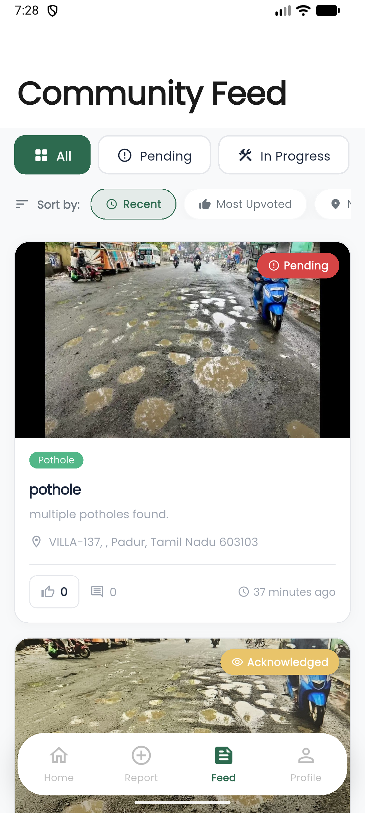
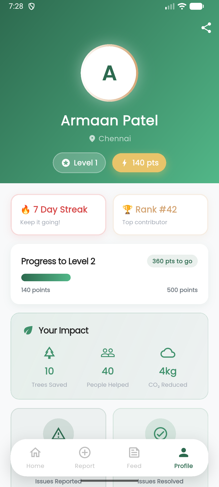
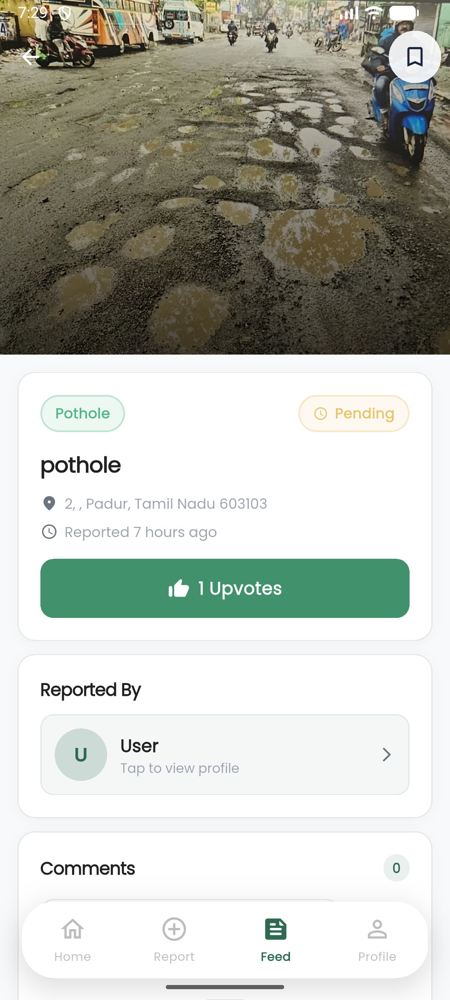
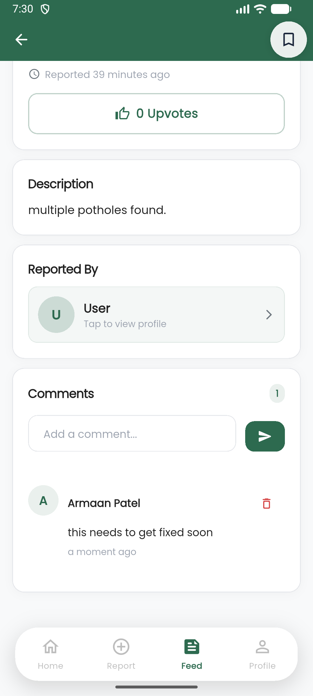
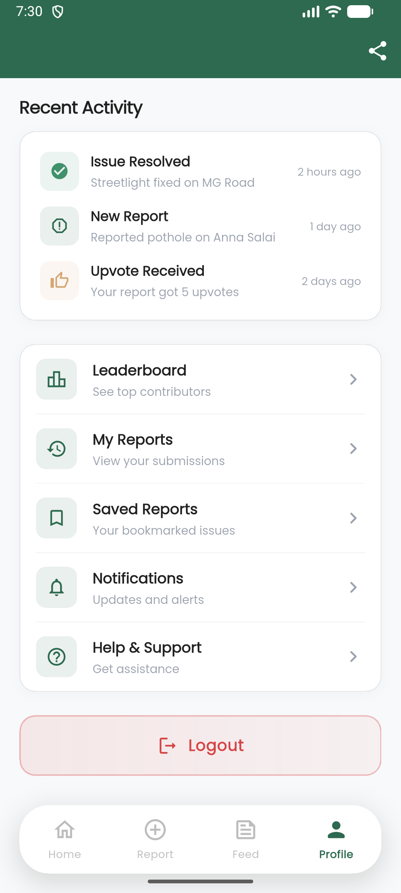
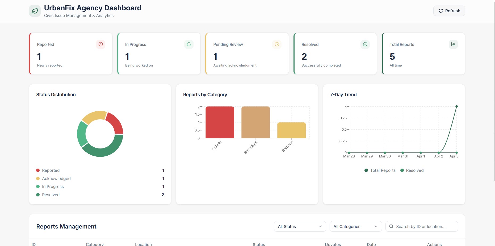

# UrbanFix

## Demo Link: 
https://drive.google.com/file/d/1KtLiQuD1oAy7a1T1sOIOxYDYqW7LmeCk/view?usp=drivesdk


Built for **Resonate 2.0**

**Team name:** one eight eight

A Flutter mobile application for reporting and tracking civic issues with photo evidence, GPS location, and community engagement.


## Team Members

1. **Mohammed Armaan Patel** - Backend & API Developer
2. **Prashant Choudhary** - Frontend UI/UX Developer
3. **Meganath Saravanan** - Maps & Location Developer
4. **Ramyapriya Sivasankar** - Reports & Integration Developer

## Tech Stack

- **Mobile**: Flutter 3.41+ (Dart)
- **Backend**: Supabase (PostgreSQL, Auth, Storage, Realtime)
- **State Management**: Provider
- **Navigation**: go_router
- **Maps**: Google Maps Flutter
- **Location**: Geolocator + Geocoding

## Features

- Report civic issues with camera/gallery photo capture
- GPS location auto-detection with address reverse geocoding
- Google Maps integration on home screen
- Community feed with category and status filters
- Upvoting and commenting system
- User profiles with stats (reports, resolved, upvotes)
- Gamification with points system
- Leaderboard for top contributors
- Real-time status tracking with timeline
- Issue categories: Pothole, Garbage, Streetlight, Footpath, Drain, Other

## Prerequisites

Before running the app, make sure you have:

- [Flutter SDK](https://docs.flutter.dev/get-started/install) (3.41+)
- A [Supabase](https://supabase.com) account (free tier works)

## Setup Instructions

### Step 1: Clone the Repository

```bash
git clone https://github.com/Armaan1005/UrbanFix.git
cd UrbanFix
```

### Step 2: Install Flutter Dependencies

```bash
flutter pub get
```

### Step 3: Set Up Supabase

1. Create a new project at [supabase.com](https://supabase.com)
2. Go to **SQL Editor** and run the contents of `supabase_schema.sql`
3. Go to **Storage** and create a public bucket named `report-images`
4. Go to **Settings > API** and copy your **Project URL** and **anon public key**

### Step 4: Configure Credentials

Edit `lib/config/supabase_config.dart`:

```dart
class SupabaseConfig {
  static const String supabaseUrl = 'https://YOUR_PROJECT_ID.supabase.co';
  static const String supabaseAnonKey = 'YOUR_ANON_KEY_HERE';
  static const String storageBucket = 'report-images';
}
```


### Step 5: Run the App

```bash
# Check everything is ready
flutter doctor

# Run on connected device or emulator
flutter run
```

## Project Structure

```
UrbanFix/
├── lib/
│   ├── main.dart                  # App entry point
│   ├── config/
│   │   ├── supabase_config.dart   # Supabase credentials
│   │   ├── app_config.dart        # Categories, statuses, points
│   │   ├── theme.dart             # Material 3 earth-tone theme
│   │   └── routes.dart            # go_router navigation
│   ├── models/
│   │   ├── report.dart            # Report, TimelineEvent, Evidence
│   │   ├── user.dart              # AppUser, Badge, UserStats
│   │   └── comment.dart           # Comment model
│   ├── providers/
│   │   ├── auth_provider.dart     # Supabase auth (login, register, logout)
│   │   ├── report_provider.dart   # Report CRUD, upvotes, comments
│   │   └── user_provider.dart     # User stats, leaderboard
│   ├── services/
│   │   ├── storage_service.dart   # Image pick + Supabase upload
│   │   └── location_service.dart  # GPS + geocoding
│   ├── screens/
│   │   ├── splash_screen.dart     # App launch screen
│   │   ├── main_navigation_screen.dart  # Bottom nav bar
│   │   ├── auth/
│   │   │   ├── login_screen.dart
│   │   │   └── register_screen.dart
│   │   ├── home/
│   │   │   └── home_screen.dart   # Google Maps + dashboard stats
│   │   ├── report/
│   │   │   ├── report_issue_screen.dart   # Create new report
│   │   │   └── report_details_screen.dart # View report details
│   │   ├── feed/
│   │   │   └── community_feed_screen.dart # Browse all reports
│   │   └── profile/
│   │       ├── profile_screen.dart
│   │       └── leaderboard_screen.dart
│   └── widgets/
│       └── report_card.dart       # Reusable report card
├── supabase_schema.sql            # Database schema (run in Supabase)
├── pubspec.yaml                   # Flutter dependencies
└── README.md
```

## Demo Screenshots

<p align="center">
  
  
  
  
  
  
  
  
  
  
</p>

## Database Schema

The app uses the following Supabase tables:

| Table | Purpose |
|-------|---------|
| `users` | User profiles (extends Supabase auth) |
| `reports` | Civic issue reports with GPS + photos |
| `upvotes` | User upvotes on reports |
| `comments` | User comments on reports |
| `timeline_events` | Status change history |
| `evidence` | Additional photo evidence |
| `saved_reports` | Bookmarked reports |
| `badges` | User achievement badges |
| `agencies` | Government agencies |

## App Screens

| Screen | Description |
|--------|-------------|
| Splash | Animated launch screen with auth check |
| Login | Email/password sign in |
| Register | Full registration with name, phone, city, ward |
| Home | Google Maps + dashboard stats + quick actions |
| Report Issue | Camera/gallery photo, category picker, GPS location, submit form |
| Community Feed | Scrollable reports with category/status filters |
| Report Details | Full report view with timeline, comments, upvote |
| Profile | User stats, points, menu (my reports, saved, leaderboard) |
| Leaderboard | Top contributors ranked by points |

## How It Works

1. **User signs up** with email, name, phone, city, and ward
2. **Reports an issue** by taking a photo, selecting a category, and the app auto-captures GPS location
3. **Report appears** in the community feed for all users
4. **Other users** can upvote and comment on reports
5. **Status updates** are tracked via timeline (reported > acknowledged > in progress > resolved)
6. **Points are awarded** for reporting (50), receiving upvotes (10), and resolution (100)
7. **Leaderboard** ranks top contributors by points

## License

MIT
